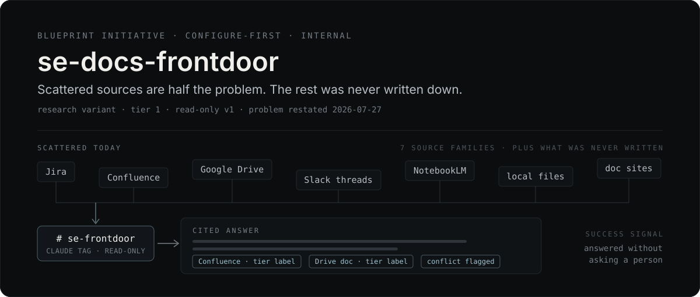

<p align="center">
  
</p>

## What this is

Sales engineers at commerce.com assemble client solutions out of documents scattered across Jira, Confluence, Google Drive, Slack threads, NotebookLM, local files, and internal doc sites. Most of the research time goes into finding and cross-referencing, not reasoning. When that fails, the fallback is interrupting one of the few long-tenured colleagues who hold the history. As of the 2026-07-27 kickoff that is effectively one person.

The obvious fix is a single place to ask, answering with citations. That was this initiative's founding scope, and it is no longer the whole problem.

A sponsor kickoff on 2026-07-27 established that the documents are produced as a byproduct of billable delivery work: documentation stops when project hours run out, small projects get no folder at all, the template is not uniformly followed, and some documents are actively wrong where the platform shipped features that invalidated documented workarounds. **Capture quality bounds retrieval quality** — no search technique recovers a retrospective nobody wrote.

So the problem has two halves that were previously treated as one: getting answers out of what exists, and fixing what gets written down. Read `research/problem-space/problem-statement.md` first — it is canonical and supersedes the narrower framing still recorded in `blueprint.yml`.

Private, internal planning repo. It runs on [Blueprint](https://github.com/nino-chavez/blueprint), a delivery methodology that stages work from research through to a shipped decision.

## Where it stands

Research from the founding session (2026-07-09) is banked and still valid. The **problem it was organized around changed** on 2026-07-27, so the initiative is between framings: the problem has been restated, and the pipeline has not yet been re-shaped to match.

The state is checkable rather than asserted. `actor-output.yml` declares every actor, the outcome they need, and the output that serves it; a gate grades whether those outputs actually exist:

```console
$ npm run manifest:gate
actor-output.yml: PENDING (route actor-output; 0 errors, 4 pending, 0 warns)
```

| Output | What it is | State |
| --- | --- | --- |
| `research/problem-space/problem-statement.md` | Canonical problem statement | current |
| `HANDOFF.md` | Session recovery, including an explicit do-not-do list | current |
| `decisions/0001-…` | Configure-first. Stands, with two 2026-07-27 qualifications | accepted |
| `docs/se-team-brief.html` | Sponsor brief | **draft** — framing superseded |
| Slack front door | The configured channel itself | planned |
| Pilot protocol · Measurement plan | Both presuppose the superseded model | planned |

Two things that gate deliberately:

- The channel cannot go live until `research/pilot/baseline-pings.md` exists, because the success signal — how often questions get answered without interrupting a senior colleague — becomes permanently unmeasurable if launch precedes the baseline.
- The sponsor brief was demoted from `ready` to `draft`, which is why nothing currently `ready` serves the sponsor's decision. Its research content holds; its pilot shape, metric, and audience do not.

Four open boundary decisions are named with owners in the problem statement, covering the read/write boundary, the audience, whether an existing internal assistant already owns this surface, and funding. Three need the sponsor.

## Why configure instead of build

Blueprint's Stage 2 normally produces a working prototype. This initiative deliberately does not, and [ADR-0001](decisions/0001-configure-first-pilot-as-prototype.md) records why.

The riskiest assumptions here are not answerable in code. Can the Enterprise connector actually see Shared Drives? Are prompt-level authority labels good enough, or do they lose too much? Is citation quality acceptable against the real corpus? Every one of those is only testable by configuring against live sources. A built prototype would have tested the fallback while leaving the primary path unexamined.

Buying was retired outright. Uniform ACLs removed the one requirement a purchased tool uniquely served, and existing Claude Enterprise spend removes the seat-economics argument. The kickoff did nothing to restore either justification.

The kickoff moved this decision in both directions, recorded in the ADR's Amendments section. It got **stronger** — the sponsor independently reached for a Claude-native surface twice, and put the delivery floor at two months composed entirely of security review and hosting, which is overhead a configured path may avoid. It got **weaker** — Gong call recordings are a named in-scope source, are already pulled via a separate integration tool, and are not covered by the standard connectors. That is trigger 3 below, not yet fired, and unresolvable until the corpus census runs.

One question outranks all of this and is still open: the sponsor referred twice to an existing internal assistant. If it exists, it is either the delivery vehicle or prior art, and it may already carry the approvals that make up the entire stated two-month floor.

### What would restart a build

A thin custom app — Slack Bolt, the Messages API, federated retrieval tools returning `search_result` blocks — is contingent on the pilot failing in one of four named ways:

1. **Shared-Drive blindness** — the connector cannot see Shared Drives.
2. **Tier-label inadequacy** — prompt-level authority labels and conflict-surfacing prove too lossy.
3. **Scoping gaps** — Tag cannot restrict search to named SE channels, or cannot cover the CMS-backed internal doc sites.
4. **Telemetry ceiling** — measuring self-service resolution needs per-question logging Tag does not expose, and manual survey plus senior self-report prove insufficient.

### Commitments that bind either branch

- **Read-only v1 is a hard line.** No writes of any kind. Revisiting is a v2 decision with its own ADR.
- Wide corpus with authority-tier labels. Conflicts get surfaced and flagged, never silently resolved.
- Citations on every answer, deep-linked where the source allows.
- Async-first. No call-time fast lane in v1.
- ~~Demand-driven filing: when the bot misses on trapped content, that content moves into Drive or Confluence.~~ **Falsified 2026-07-27.** This works when content exists and is misplaced. It does nothing when the content was never written because project hours ran out — which the kickoff established as structural, not incidental. It remains valid only for the narrow local-file case it was originally scoped to.
- Answer from current-stable docs; label version-specific content.

## Working in this repo

The first useful action is grading the manifest, not installing anything.

```bash
npm run manifest:gate   # readiness — does a real output serve every outcome? (expect PENDING)
npm run manifest:check  # lint the manifest without grading readiness
npm run reader:check    # audit rendered surfaces against reader-contract.json

npm install && npm run dev   # only if you want the portal running locally
```

`manifest:*` and `derive` shell out to the Blueprint methodology source rather than to anything vendored here. Set `BLUEPRINT_HOME` if that checkout is not at `~/Workspace/dev/tools/blueprint`, or those commands will fail to resolve their module.

The Blueprint reviewer runner is not stamped into initiatives either. Run it from the same source:

```bash
node ~/Workspace/dev/tools/blueprint/template/tools/run-reviewers.mjs
```

Two gotchas worth knowing before you edit: persona job-to-be-done entries must stay in list shape (`jtbd:` followed by `- surface: …`), because the forge-provenance reviewer parses only that shape; and `portal-chrome-canonical` reports `TEMPLATE_MISSING` against the methodology repo itself, which is an upstream issue rather than a defect here.

## Repo map

| Path | What's there |
| --- | --- |
| `research/problem-space/` | **Start here.** The canonical problem statement. Supersedes the founding framing. |
| `research/sources/` | Input assets with provenance — the 2026-07-09 founding grill ledger, and the 2026-07-27 sponsor kickoff with load-bearing quotes transcribed. |
| `research/` (rest) | Founding corpus — personas, buy landscape, current-state source map. Valid as evidence; organized around the superseded causal model. |
| `decisions/` | Decision records. ADR-0001 is configure-first, with a 2026-07-27 Amendments section recording what the kickoff strengthened and weakened. |
| `docs/` | The sponsor brief. Carries a superseded banner; research content holds, framing does not. |
| `actor-output.yml` | The live contract: actors, outcomes, outputs, preconditions. Currently encodes outputs shaped by the superseded framing, flagged inline. |
| `HANDOFF.md` | Position, next steps, and an explicit do-not-do list of actions that would regress the framing. |
| `METHODOLOGY-AMENDMENTS.md` | Blueprint gaps this initiative hit, as promotion candidates. |
| `derived/` | Generated from `actor-output.yml` by `npm run derive`. Never hand-edit. |
| `apps/portal/`, `packages/` | Blueprint's stamped Astro portal at Tier 0 — no data sources wired. Scaffolding, not the product; drops at the research-variant re-stamp. |
| `tools/` | The reader-contract audit script. |

## Scope lines, and which ones reopened

The founding session locked four exclusions. Two still hold as written. Two were reopened by the kickoff and are now tracked as boundary decisions rather than settled scope.

| Exclusion | Status |
| --- | --- |
| **Synthesis deliverables** — solution overviews, RFP drafting | Holds. Lookup first. |
| **A call-time fast lane** — prompt-cached core for mid-call latency | Holds. Async-first. |
| **Write-back of any kind** | **Reopened.** The kickoff introduced a capture-standard concern — tooling that records knowledge going forward — which is a write system by definition. `READ-ONLY v1` is still a hard line, and ADR-0001 requires a dedicated ADR to reopen it. That ADR is the decision, not a drift. |
| **Non-SE audiences** | **Reopened.** The sponsor asked for SE and SA, then for anyone in the company. |

## Before go-live

Two human dependencies, both outside this repo: a Claude Enterprise admin to grant connector toggles and create the pilot channel, and the long-tenured colleague who currently fields those questions, to redirect them with "ask the bot first."
