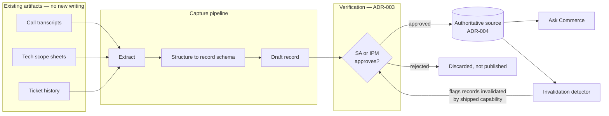

# Solution Capture: Architecture & Delivery Plan (v1 draft)

**Author**: Nino Chavez
**Date**: 2026-07-27
**Status**: Draft for review. **Not buildable yet** — five preconditions in § 3 are unmet, two of them decisions rather than work.
**Companion to**: `docs/decision-memo.md` (the sponsor memo). This plan covers only Phase 2.

---

## 1. Executive Summary

### Problem

Commerce's solution knowledge is produced as a byproduct of billable delivery. It stops when IPM hours stop, smaller engagements often get no folder at all, the template is followed differently every project, and some documents are actively wrong because the platform shipped past a documented workaround. The people who hold the missing context are few and shrinking.

### Why this plan is not a search tool

The retrieval problem is solved. `Ask Commerce` — a Claude surface maintained by AI Operations — already searches Confluence, Jira and Slack with per-user permissions, cites every claim with a last-modified date, flags sources over twelve months old, and surfaces conflicts rather than picking between them. **Building a competing surface would be waste.**

What no retrieval surface can do is produce a record that was never written. That is this plan.

### Solution

A capture pipeline that **derives** a structured solution record from work that already happened — call transcripts, tech scope sheets, ticket history — rather than asking people to write more on unbilled time. Each record is verified before it is published, and published into a location designated authoritative, so that both `Ask Commerce` and a human can trust it.

### Approach: derive, verify, then publish

Three stages, in that order, and the middle one is not optional. A generated record that is wrong is the exact defect class this initiative exists to remove, mass-produced.

### Key architecture decisions

| ADR | Decision | Trade-off |
| --- | --- | --- |
| 001 | Capture is a write system, scoped to a new record type | +Solves the actual problem, −Reopens a locked read-only invariant |
| 002 | Derive from existing artifacts; never request net-new writing | +Survives billing pressure, −Bounded by what the sources contain |
| 003 | No record publishes without human verification | +Prevents industrialising the wrong-not-stale defect, −Costs reviewer minutes per record |
| 004 | Publish into a designated authoritative source | +Ask Commerce can treat it as truth, −Depends on an AI Ops grant we do not control |
| 005 | Extend the existing generation toolchain rather than build one | +Weeks not months, −Inherits its assumptions |

### Expected outcomes

Stated as what becomes possible, not as percentages — the baseline that would let us forecast is Phase 0 output and does not exist yet.

- A solution record exists for engagements that today end with no retrospective.
- That record is reachable through the tool everyone already uses.
- The wrong-not-stale class becomes detectable on a schedule rather than discovered in front of a client.

---

## 2. Scope

**In scope.** Deriving, verifying and publishing a solution record per engagement. The record's schema. The verification workflow and who performs it. The re-detection job for documents invalidated by shipped platform capability.

**Out of scope, and deliberately.** The question surface (`Ask Commerce` owns it). Connector work to make Drive readable — that is a Phase 1 request to AI Operations, and a precondition here rather than a task. Migration or remediation of the existing corpus. Anything customer-facing.

**Actors.**

| Actor | Relationship |
| --- | --- |
| Delivery / IPM | Produces the source material. Must not be asked for additional unbilled writing |
| Solutions architect | Verifies derived records for the engagements they ran |
| Sales engineer | Consumes records through Ask Commerce. Never interacts with this pipeline directly |
| AI Operations | Owns the publish target and the authoritative-source designation |
| Sponsor | Owns the read/write decision and the reviewer-time budget |

---

## 3. Input Requirements — the preconditions

**If these are incomplete, this system produces nothing of value.** Three are work; two are decisions. None is in this plan's gift.

### Precondition A — Corpus census results

| Property | Detail |
| --- | --- |
| **Owner** | Nino |
| **Source** | `research/pilot/phase-0-census-design.md`, Workstreams A and B |
| **Due** | Before build starts |
| **Blocks** | Record schema, and the entire business case |

**Why needed**: the schema should mirror what good records already contain, and the wrong-not-stale rate is what determines whether this is worth building at all. **Quality criteria:**

- [ ] Audited Drive inventory, not a scraped floor
- [ ] Fraction of engagements with no tech scope at all — the size of the hole this fills
- [ ] Wrong-not-stale rate with a stated confidence interval
- [ ] Contradiction count

### Precondition B — Drive connected to Ask Commerce

| Property | Detail |
| --- | --- |
| **Owner** | AI Operations, requested by the sponsor |
| **Due** | Before verification workflow design |
| **Blocks** | ADR-004, and the value of every published record |

**Why needed**: Ask Commerce cannot read Drive contents today. Publishing records it cannot see makes them invisible to the only surface anyone uses. **If this request is refused, stop and rethink — do not proceed with a workaround.**

### Precondition C — Authoritative source designated for solution knowledge

| Property | Detail |
| --- | --- |
| **Owner** | AI Operations, requested by the sponsor |
| **Due** | Before first publish |
| **Blocks** | ADR-004 |

**Why needed**: Ask Commerce explicitly demotes team- and project-space pages, naming `SE`, `TAM` and `IPM` among them. Without a designation, a published record is searchable but never treated as settled. **Quality criteria:** a named page or space, a named owner, and a stated review cadence.

### Precondition D — Read/write decision (`BD-1`)

| Property | Detail |
| --- | --- |
| **Owner** | Sponsor, with Nino |
| **Due** | Before any build |
| **Blocks** | Everything. This plan does not exist if the answer is read-only |

**Why needed**: `ADR-0001` locked read-only as a hard line requiring a deliberate ADR to reopen. ADR-001 below is that ADR, and it needs a sponsor decision rather than an author's assertion.

### Precondition E — Reviewer time, committed

| Property | Detail |
| --- | --- |
| **Owner** | Sponsor |
| **Due** | Before pilot |
| **Blocks** | ADR-003, which is what keeps this from being harmful |

**Why needed**: verification costs senior SA minutes per record. Unbilled senior time is precisely the constraint that caused the original problem, so it must be granted explicitly rather than absorbed quietly. **An uncommitted reviewer budget means ADR-003 fails silently, which is worse than not building this.**

### Precondition F — TAM practice interview *(soft)*

Not blocking, but cheap and high-value. `TAM` is the one space in the census whose documentation is not decaying — 57% touched within twelve months against 19–21% for `SA` and `IPM`, under identical billing pressure. Understanding why may replace half this architecture with a process change.

---

## 4. Solution Strategy

### ADR-001: Capture is a write system, scoped to one new record type

**Decision**: Reopen the read-only invariant, narrowly. This system writes solution records and nothing else. It never modifies an existing document.

**Rationale**: The problem is absent records, not misfiled ones. A read-only system cannot address it. Scoping writes to a single new artifact type keeps the privacy and security surface reviewable, and makes the AI Use Case Review a bounded question.

**Trade-off**: +Addresses the actual failure, −Reopens a deliberately locked decision and enlarges the review surface.

**Alternatives rejected**: Recommend capture to a successor initiative — leaves this project delivering nothing that isn't already delivered. Write into an existing document — unbounded blast radius, and no reviewer would sign it off.

### ADR-002: Derive from existing artifacts; never request net-new writing

**Decision**: Inputs are artifacts that already exist as a byproduct of delivery. The pipeline never asks a human to author prose.

**Rationale**: Documentation stops when hours stop. Any design whose adoption depends on unbilled writing loses to the same pressure that created the gap. A standard template already exists and is followed inconsistently, which is evidence that asking harder does not work.

**Trade-off**: +Survives the billing constraint that killed every prior attempt, −The record can only be as complete as the sources; engagements that generate no artifacts still produce nothing.

### ADR-003: No record publishes without human verification

**Decision**: Every derived record is reviewed and explicitly approved by the SA or IPM who ran the engagement before it becomes visible. Unverified records are not published in a degraded state — they are not published.

**Rationale**: This is the load-bearing decision. An unverified generated record is the wrong-not-stale defect produced at scale and carrying a citation, which is strictly more dangerous than an absent record because someone acts on it in front of a client. Ask Commerce already hand-patches individual corpus contradictions one line at a time; feeding it machine-generated unverified content would make that maintenance burden unbounded.

**Trade-off**: +Prevents the failure mode that would discredit the whole initiative, −Throughput is capped by reviewer availability, and Precondition E is a hard dependency.

### ADR-004: Publish into a designated authoritative source

**Decision**: Records land in a location AI Operations has designated authoritative for solution knowledge.

**Rationale**: Ask Commerce demotes team spaces by policy. Publishing anywhere else produces records that are searchable but never trusted — the same standing problem the existing corpus has, reproduced in new documents.

**Trade-off**: +Records count as truth, −Hard dependency on Preconditions B and C, neither of which we control.

### ADR-005: Extend the existing generation toolchain

**Decision**: Build on the existing internal content-generation pipeline (`forge-signal`) rather than writing one. Its mode-specific pipelines, voice validation and multi-format export already exist and are proven on adjacent work.

**Rationale**: Generation is the cheapest part of this problem and the part most likely to be over-engineered. Reusing a working pipeline concentrates effort on verification and publication, which is where the risk actually lives.

**Trade-off**: +Weeks rather than months to a testable pipeline, −Inherits its assumptions and its provider dependencies; it was built for authored content, not derived records, and the mode may need extending.

---

## 5. Container View

The loop at the bottom matters as much as the forward path. The invalidation detector is the changelog join specified in `phase-0-census-design.md` § B1, promoted from a one-time census instrument to a standing job: when the platform ships a capability, records describing a workaround for its absence are flagged back into the verification queue rather than silently rotting.

## 6. Runtime View — an engagement closes

1. Engagement reaches a close signal (ticket state, or a scheduled sweep).
2. Pipeline gathers the artifacts that exist for it. **If below a minimum threshold, it stops and records "insufficient source material"** — this null result is itself a Phase 0 metric worth keeping.
3. Extraction and structuring produce a draft record against the schema.
4. Draft is queued to the SA or IPM who ran the engagement, with the source artifacts linked so verification is a check, not a rewrite.
5. Approved records publish. Rejected records are discarded with the rejection reason retained — rejection reasons are the training signal for whether ADR-002 is working.
6. The invalidation detector re-queues published records when a platform capability lands that contradicts them.

## 7. Delivery Plan

Sequenced by dependency. **Effort is deliberately absent** — estimating before Precondition A returns would be the same mistake the first memo made.

| Stage | Content | Gated on |
| --- | --- | --- |
| 0 | Preconditions A–E resolved | Phase 0 census; two AI Ops requests; sponsor decisions |
| 1 | Record schema, derived from what good existing records contain | Precondition A |
| 2 | Extract and structure on one engagement, end to end, by hand | Stage 1 |
| 3 | Pipeline on `forge-signal`; verification queue | Stage 2 proving the record is worth having |
| 4 | Pilot on a small number of closed engagements with committed reviewers | Precondition E |
| 5 | Invalidation detector promoted to a standing job | Stage 4 |

**Stage 2 is the real go/no-go.** Producing one record by hand, and asking the SA who ran that engagement whether they would have wanted it, answers the only question that matters before anything is built. If the answer is no, nothing downstream is worth doing.

## 8. Risks

| Risk | Consequence | Response |
| --- | --- | --- |
| Drive connection refused (Precondition B) | Records publish somewhere nobody searches | Stop. Re-plan, do not work around |
| Reviewer time not committed (E) | ADR-003 degrades to rubber-stamping | Treat as a stop condition, not a slippage |
| Wrong-not-stale rate turns out low | The premise weakens; retrieval may be enough | Accept it. Phase 0 exists to be able to hear this answer |
| Sources too thin to derive from | ADR-002's bet fails | Stage 2 detects this on one engagement, before any build |
| Generated records are plausible but wrong | The defect class, industrialised | ADR-003, plus tracking rejection reasons as a live quality signal |

## 9. What this plan does not decide

- **Effort and duration.** Gated on Precondition A. Any number now would be invented.
- **The record schema.** Derived from evidence in Stage 1, not designed in advance.
- **Audience.** `BD-2` is open; this plan assumes SE and SA and would not change much for a wider one.
- **Whether the TAM practice replaces part of this.** Precondition F could remove the need for stages 3–5 entirely, which would be the best available outcome.

---

**Traceability** — Problem framing and claim handles: `research/problem-space/problem-statement.md` (`P1`–`P8`, `BD-1`–`BD-4`). What already exists and its gaps: `research/prior-art/ask-commerce.md` (`AC-1`–`AC-4`). Corpus measurements: `research/current-state/confluence-corpus-census.md` (`C-1`–`C-5`). Approval route and data classification: `research/current-state/ai-governance-constraints.md` (`G1`–`G8`). Precondition A's method: `research/pilot/phase-0-census-design.md`. ADR-001 is the deliberate reopening that `decisions/0001-configure-first-pilot-as-prototype.md` requires for any write system. Format follows the solution-architecture-plus-delivery-plan pattern in `~/Workspace/dev/ref/forge-signal-ref/projects/signet/aeo/`.
