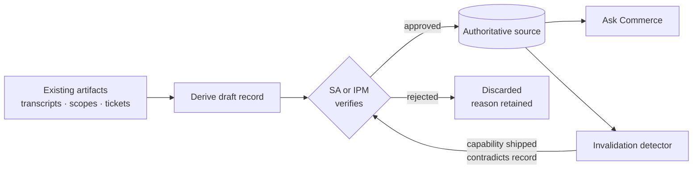

# Solution Plan — SE/SA Knowledge Capture

**Author**: Nino Chavez
**Date**: 2026-07-27
**Status**: **Pre-decision.** Nothing here is committed. Four of the nine open questions in § 8 are decisions that have not been made, and the two assumptions that carry the plan (`A3`, `A5`) are untested. Read § 6 first if you want the short version — it is what this initiative has ruled out.
**Audience**: Andrew (sponsor), Mark, Zac, and AI Operations for § 9.3.

---

## 1. Summary

A decade of platform knowledge sits in a shrinking number of people. The documents that should hold it are produced as a byproduct of billable delivery, so they stop where billing stopped, vary where the template was optional, and are wrong where the platform shipped past a documented workaround.

Discovery changed what this project is. **The retrieval half is already built and running** — `Ask Commerce`, maintained by AI Operations, does six of the seven things this project set out to do. What it cannot do is read the corpus that matters, treat solution knowledge as authoritative, or produce a record nobody wrote.

So the plan is: **measure the corpus, ask AI Operations for two things, and build the capture side.** Only the third is a build, and it is gated on a decision that has not been made.

---

## 2. Analysis — how the problem was reframed twice

### 2.1 The founding framing, and why it broke

The 2026-07-09 definition was: *SEs rely on scattered documents; build a front door to query across them.* That treated the corpus as a noisy given whose hygiene would improve as a byproduct of use.

The sponsor kickoff on 2026-07-27 broke it. Between Mark and Zac, four structural holes:

- One-off client conversations sometimes never enter a documented process (Mark).
- Smaller engagements often get no project folder; the example given was twenty-hour projects (Mark).
- Documentation stops when IPM hours run out, leaving solutions half-worked and retrospectives absent (Zac).
- A standard template exists and is followed differently every project (Zac).

That inverts the dependency. Hygiene is an **input** to retrieval quality, not an output of it. One founding decision was falsified rather than narrowed: demand-driven filing works when content exists and is misplaced, and does nothing when content was never written.

### 2.2 The second reframe, and it was the bigger one

The kickoff left an open question — the sponsor twice referred to an existing internal capability, "something similar to ask commerce" (00:09:27) and "directly within CLA, like ask commerce" (00:33:23). That was recorded as the question that would most change the plan.

It was not an analogy. Discovery on 2026-07-27 found `Ask Commerce` live, org-wide, and already implementing most of what this project had specified. **A memo proposing to build it had been drafted and was one decision away from being sent.**

### 2.3 What discovery actually consisted of

Stated so the findings can be weighted, and so a reader knows which are measured and which are read.

| Method | Covered |
| --- | --- |
| Sponsor kickoff, transcribed with speaker attribution | The four structural holes; sponsor intent; the two-month floor |
| Two internal governance registers | Data classification, approval routes, tool status |
| Confluence REST API, authenticated | Corpus counts and recency across five spaces |
| Google Drive, web UI | Opportunity corpus structure and an order-of-magnitude count |
| `Ask Commerce` configuration and documentation, read directly | What exists, what it can reach, how it ranks and demotes |

**One method was attempted and failed**: running real SE questions through Ask Commerce and recording the answers. Blocked on a per-person Claude spend cap, not on access. It remains the most valuable outstanding measurement.

---

## 3. Known research — what we have established

Every claim below is sourced. Handles in brackets are citable from the research corpus.

### 3.1 The corpus is measured in Confluence, sized in Drive

| Space | Pages | Touched < 12 months |
| --- | ---: | ---: |
| Technical Project Management (`IPM`) | 1,599 | 335 |
| Solutions Architects (`SA`) | 912 | 173 |
| Technical Account Management (`TAM`) | 441 | 252 |
| Solutions Engineering (`SE`) | 155 | 35 |
| Solution Architecture Knowledge Base (`SIPR`) | 66 | 22 |
| **Total** | **3,173** | **817 (26%)** |

59% has not been touched in two years. `[C-1..C-4]`

**Drive is where the volume is.** The `Opportunities` shared drive holds one folder per client opportunity, with the tech scope as a Sheet from a shared template. The 2026 folder alone holds **at least 692** — more than four times the entire `SE` Confluence space. That number is a floor from a file listing, **not an audited count**; earlier years are uncounted. `[C-5]`

Three structural findings matter more than the totals:

- **The primary persona's own space is the smallest and stalest.** The knowledge lives in IPM, SA and TAM — other organisations. That is why an SE asks a person: the answer was never filed where an SE would look. `[C-2]`
- **TAM's documentation is not decaying** — 57% touched within twelve months against 19–21% for SA and IPM, under identical billing pressure. A working internal counterexample. `[C-3]`
- **Timestamps cannot find wrong.** Every number above measures editing, not truth. `[C-4]`

### 3.2 The question surface exists

`Ask Commerce` — Anthropic's native ask-your-org surface, configured and maintained by AI Operations. Active, shared with every employee by default, no access request. Connected to **Confluence, Jira and Slack**. Respects each user's permissions. Cites every claim with source, last-modified date and URL. Flags sources over twelve months old. Surfaces conflicts instead of picking between them. `[AC]`

Two gaps define the remaining work:

- **It cannot read Google Drive.** It sees that a file exists and cannot open it. The tech scopes are in Drive. `[AC-1]`
- **Solution knowledge has no authoritative source, and its spaces are demoted.** The routing table designates sources of truth for tool approval, HR, insider trading and deployment. Nothing for how we solve things for clients — and `SE`, `TAM` and `IPM` are explicitly named as non-authoritative. So 3,173 searchable pages can never be treated as settled. `[AC-2]`

### 3.3 The capture argument now has first-party evidence

Ask Commerce's configuration contains **hand-written patches for individual contradictions in our documentation** — one page using two names for the same Slack channel, two pages disagreeing on a GitHub organisation name, with an instruction not to state that name confidently. `[AC-4]`

Every contradiction becomes a line of configuration a person maintains. It works. It does not scale. **One team is absorbing our documentation defects by hand, one defect at a time.** This is the strongest available argument for the capture work, and it comes from Commerce's own system rather than from theory.

### 3.4 Governance is not the obstacle it appeared to be

Every employee already has Claude — no request, no seat, usage-based billing with a **$1,000 monthly cap per person**. The relevant approval route is **Use-Case #2**: an existing approved tool processing a new type of data, which means an AI Use Case Review with a Privacy Impact Assessment, not a vendor intake. `[G2, G4]`

Two cost drivers to respect: an **AppSec review triggers on new MCP, integrations, or custom code**, and escalations go to an **AI Review Committee meeting quarterly** — a tail that could exceed the sponsor's entire stated two-month floor. A configured path adding no custom code avoids the first entirely. `[G2]`

---

## 4. Guiding principles

The first six are carried from the problem statement and hold unchanged. The last three are new, and follow from discovery.

1. **Cite or say nothing.** An answer about what the platform *cannot* do gets acted on in front of a client, and parts of the corpus are wrong rather than old. The reader must be able to check.
2. **Recency is correctness, not metadata.** Document age carries information about whether the content is still true.
3. **Surface conflicts; do not adjudicate them.** Contradiction is guaranteed. A single confident answer will sometimes be the stale one.
4. **Assume no schema.** Every project documents differently.
5. **Measure against the person.** The person-to-person round trip is the baseline; usage is only a proxy.
6. **Coverage follows verified quality, not ambition.** Indexing everything indexes the wrong things too.
7. **Do not rebuild what already runs.** The retrieval surface exists and is owned. Effort goes where nothing exists.
8. **Derive; never ask for more writing.** Documentation stops when hours stop. Any design whose adoption depends on unbilled writing loses to the pressure that created the gap.
9. **Verify before publishing.** A generated record that is wrong is the corpus's worst defect, mass-produced and carrying a citation. Unverified output does not ship in a degraded state; it does not ship.

---

## 5. The plan

### Phase 0 — Measure the corpus *(designed; partially run)*

Protocol in `research/pilot/phase-0-census-design.md`. Two weeks elapsed, roughly four hours of senior SE/SA time.

- **Inventory.** Confluence is done. Drive needs API access, not more scraping.
- **Quality.** A changelog join finds the wrong-not-stale class cheaply, by joining shipped platform capabilities against documents that predate them and describe a workaround for their absence. A 50-document adjudicated sample gives a rate at roughly ±14 points.
- **Demand baseline.** Must be captured now — it is unmeasurable after launch, and Phase 0 is the only pre-launch window.

The single most useful output: **what fraction of engagements have no tech scope at all.** That is the closest available answer to "what fraction of questions have an answer anywhere."

### Phase 1 — Two requests to AI Operations *(not a build)*

1. **Connect Drive contents**, starting with tech scopes and SA folders.
2. **Designate an authoritative source for solution knowledge.** Start narrow — `SIPR` is 66 pages, small enough to actually vet — rather than asking them to bless the estate.

The second is harder: every current entry is owned by a governance or platform function, so domain knowledge is a new category.

### Phase 2 — Build the capture side *(the only build)*

Derive a solution record per engagement from artifacts that already exist — call transcripts, tech scope sheets, ticket history — verify it with the person who ran the engagement, publish it where Ask Commerce will trust it.

The loop matters as much as the forward path: the changelog join from Phase 0 becomes a standing job, so records invalidated by a shipped capability return to the queue instead of rotting silently.

**Decisions this phase rests on**, stated as decisions rather than assertions:

| # | Decision | Trade-off |
| --- | --- | --- |
| D1 | Capture writes, scoped to one new record type; never modifies existing documents | +Addresses the actual failure, −Reopens a locked read-only invariant |
| D2 | Derive from existing artifacts; never request net-new writing | +Survives billing pressure, −Bounded by what sources contain |
| D3 | No record publishes without human verification | +Prevents industrialising the defect, −Throughput capped by reviewer time |
| D4 | Publish into a designated authoritative source | +Records count as truth, −Depends on a grant we do not control |
| D5 | Extend `forge-signal` rather than build a pipeline | +Weeks not months, −Inherits its assumptions |

**Sequencing note.** Stage one of this phase is to produce **one record by hand** for a closed engagement and ask the SA who ran it whether they would have wanted it. That answers the only question that matters, costs a day, and precedes any build.

### Phase 3 — Discovery support *(unchanged, still last)*

Generating the hard questions for a given merchant, including the disqualifying ones. Depends on negative knowledge being present and current, which is what Phases 0–2 exist to address. The tech scope Andrew demonstrated already does a version of it; build from that rather than beside it.

---

## 6. What we are deliberately not doing

The most useful section in a plan whose headline finding is that most of what was proposed already exists. Each of these was in scope at some point in this initiative's history, and each is now excluded on evidence rather than on preference.

| Not doing | Why | What would reopen it |
| --- | --- | --- |
| **Building a question surface** | `Ask Commerce` implements six of the seven guiding principles, org-wide, maintained by another team. Building one would be waste, and a worse version | AI Ops deprecating it (`A1`) |
| **Building connectors** | Drive access is a request to AI Operations, not an engineering task. Building our own would trigger an AppSec review and duplicate their roadmap | A refusal, which is a stop-and-re-plan signal rather than a build trigger |
| **Migrating or remediating the existing corpus** | 3,173 Confluence pages plus Drive. Cleaning them is unbounded, and it does not address why they got that way. Fixing the production process is the durable version | A specific high-traffic subset shown to be actively harmful |
| **Designing a documentation template** | One exists and is followed differently every project. The constraint is unbilled hours, not template quality — a better template loses to the same pressure | Evidence that the template, not the time, is what fails |
| **Adjudicating contradictions automatically** | Locked at founding and unchanged: surface conflicts, do not resolve them. Automated resolution produces a confident answer that is sometimes the stale one | Nothing currently foreseen. This is an invariant, not a trade-off |
| **Indexing everything** | Coverage follows verified quality. Indexing the whole estate indexes the wrong things alongside the good | A census showing quality is uniformly high, which nobody expects |
| **Using DM volume as the deflection metric** | It counts the sponsor's *outbound* questions, not inbound demand on him. Both are real; they are not the same number | Nothing — but the inbound instrument still has to be built |
| **Writing any code before one record exists by hand** | Phase 2 stage one produces a single record manually and asks the SA who ran that engagement whether they wanted it. A day, and it can end the project | That test passing |

**The pattern worth noticing.** Six of these eight are things a reasonable person would have built. Two of them — the question surface and the connectors — this initiative had actively planned. They are excluded because discovery found the work already done or already owned, not because they were bad ideas.

## 7. Assumptions

Each is stated with what would falsify it. Where an assumption is load-bearing and untested, that is the honest status.

| # | Assumption | Basis | What would falsify it |
| --- | --- | --- | --- |
| A1 | Ask Commerce remains the org's question surface | Active, maintained, org-wide, reviewed June 2026 | AI Ops deprecating or restructuring it |
| A2 | AI Operations accepts source and authority requests from outside their team | They publish an intake form for exactly this | A refusal, or a scope limit on what sources qualify |
| A3 | The wrong-not-stale class is material enough to justify capture | **One example** — guest tokenization. Unmeasured | Phase 0 § B returning a low rate. This is the assumption most likely to be wrong |
| A4 | Tech scopes are the most uniform corpus because template-derived | Structure observed; contents not sampled | Content sampling showing per-project variance as wide as elsewhere |
| A5 | SAs would find a derived record worth having | **Untested.** Phase 2 stage one tests it directly | An SA saying they would not have used it |
| A6 | Verifying a derived record costs less than authoring one | Plausible, unmeasured | Reviewers reporting rewrite rather than check |
| A7 | Enough source material exists per engagement to derive from | The corpus stops where billing stopped, so this is uncertain by construction | A high rate of "insufficient source material" in stage one |

**A3 and A5 carry the plan.** If either fails, Phase 2 should not be built, and the honest outcome is that Phase 1's two requests were the whole project.

---

## 8. Gaps and open questions

| # | Question | Owner | Unblocked by |
| --- | --- | --- | --- |
| Q1 | Does capture sit inside this initiative, or go to a successor? (`BD-1`) | Sponsor + Nino | A decision. Nothing else |
| Q2 | What is the audited Drive count, and what fraction of engagements have no tech scope? | Nino | Drive API access |
| Q3 | What is the wrong-not-stale rate? | Nino + a senior reviewer | Phase 0 § B, and four hours of senior time |
| Q4 | What does TAM do that keeps their documentation current? | Nino | One conversation. **Cheapest high-value item outstanding** |
| Q5 | What does Ask Commerce actually return for real SE questions? | Nino | A Claude spend cap reset or increase |
| Q6 | Who is this for — SE, SE+SA, or everyone? (`BD-2`) | Sponsor | A decision |
| Q7 | How long does an AI Use Case Review take? | Sponsor or Nino | Asking GRC |
| Q8 | Is there an IPM to talk to, and does hours-tracking live outside Confluence? | Sponsor | An introduction |
| Q9 | What is the funding line, given a $1,000/person usage cap? (`BD-4`) | Sponsor | A decision |

**Q1 gates the largest block of work. Q4 is the cheapest and may reduce it.**

---

## 9. Asks

### 9.1 Andrew

1. **Decide Q1** — does this write, or stay read-only. Everything in Phase 2 depends on it, and it determines whether this is a project or a support ticket.
2. **Make the two AI Operations requests** in Phase 1, or tell me to make them. A sponsor request lands differently, particularly the authoritative-source one.
3. **Commit reviewer time** — roughly four hours of senior SE/SA time for Phase 0's sample, and a per-record budget for Phase 2 verification. Unbilled senior time is the exact constraint that caused this problem, so it needs granting rather than assuming.
4. **Answer Q9.** The $1,000 monthly cap is the cost model if SE questions route to Claude at volume. I hit mine researching this.
5. **An introduction to an IPM** (Q8).

### 9.2 Mark and Zac

1. **The source list** — where tech scopes and project folders actually live, and which of them you would trust a colleague to act on without checking. Informal is fine.
2. **One closed engagement** you would be willing to see a derived record for, so Phase 2 stage one has a subject.
3. **A pointer into TAM** (Q4).

### 9.3 AI Operations

1. **Connect Google Drive contents** to Ask Commerce, starting with the tech scope and SA folders.
2. **Designate an authoritative source for solution knowledge** — scoped initially to a small, vettable space rather than the estate.
3. **Context on the maintenance cost** of the hardcoded authoritative-source list, which bears directly on whether request 2 is realistic.

### 9.4 What I will do without waiting

Run the Confluence half of Phase 0 (done), design the census (done), draft the AI Ops requests, and produce one record by hand for Phase 2 stage one as soon as I have an engagement from § 9.2.

---

**Traceability** — Problem framing and claim handles `P1`–`P8`, `BD-1`–`BD-4`: `research/problem-space/problem-statement.md`. Existing surface and its gaps `AC-1`–`AC-4`: `research/prior-art/ask-commerce.md`. Corpus measurements `C-1`–`C-5`: `research/current-state/confluence-corpus-census.md`. Approval route and data classification `G1`–`G8`: `research/current-state/ai-governance-constraints.md`. Census method: `research/pilot/phase-0-census-design.md`. Sponsor memo: `docs/decision-memo.md`. Decision D1 is the deliberate reopening of read-only that `decisions/0001-configure-first-pilot-as-prototype.md` requires for any write system. Jobs served: `se/JOB-1`, `sa/JOB-1` (Phases 0–1), `delivery-ipm/JOB-1` (Phase 2), `sponsor/JOB-1`–`JOB-2`, per `research/personas-and-jtbd.md`.
